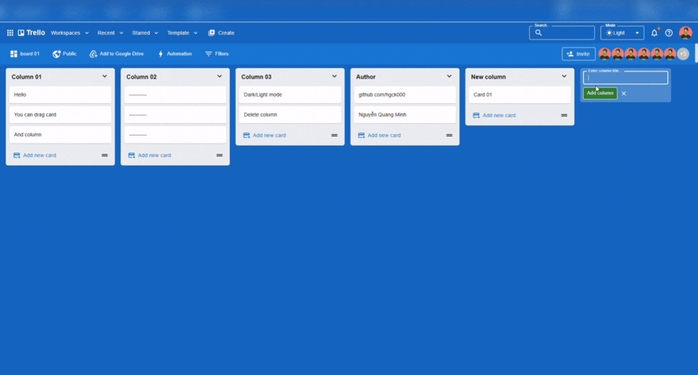
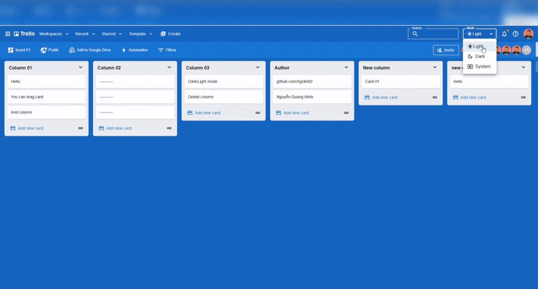

> 🦉 *“Hoo... hoo... owl never sleeps.”*
> — Cú Đại Nhân 🦉

# Trello Web (Node.js + Express.js + MongoDB)
A lightweight, modular Express.js API for a Trello-style kanban app. Handles boards, columns, cards, and drag-and-drop reordering. Runs on Node.js + MongoDB (Atlas) and deploys smoothly to Render.

---

## Features
- RESTful resources: boards / columns / cards.
- Robust reorder endpoints for columns & cards (within/between columns).
- Input validation & error handling.
- CORS (allowlist) for the Vercel frontend.
- Production-safe Mongo connection & env validation.

---

## Tech
- **Node.js 18+ + Express.js + Joi**
- **MongoDB Atlas** (Database)
- **ESLint** (babel parser)
- **Babel (preset-env, runtime) + Nodemon** (Build/Run)
- Deploy: **Render**

**Live:** https://trello-web-bay.vercel.app/

---

## Preview

Here’s a quick look at the UI:





---

## Environment Variables
Create `packages/server/.env` (values are examples):

```dotenv
MONGODB_URI=mongodb+srv://<user>:<pass>@cluster.mongodb.net/?retryWrites=true&w=majority
DATABASE_NAME=trello-quangminh
JWT_SECRET=change-this-to-a-strong-secret
PORT=8080
NODE_ENV=production
```

*Important: **MONGODB_URI** must be a single line (no quotes, no line breaks).*

---

## Quick Start (after clone)

*...**FOR LINUX**...*
```bash
chmod +x sync.sh
./sync.sh
```

*...**FOR WINDOWS**...*
```bash
# 1) Require: Node.js >= 18
node -v

# 2) Active Yarn (if yarn is not available)
corepack enable
corepack prepare yarn@stable --activate

# 3) Install dependencies
# Yarn:
yarn
# (If you don't use Yarn, you can use npm:)
# npm install

# 4) Create file .env (example)
$envText = @"
MONGODB_URI=mongodb+srv://<user>:<pass>@cluster.mongodb.net/?retryWrites=true&w=majority
DATABASE_NAME=trello-quangminh
PORT=8080
NODE_ENV=development
"@


# 5) Run dev
yarn dev
# (OR: npm run dev)
```
